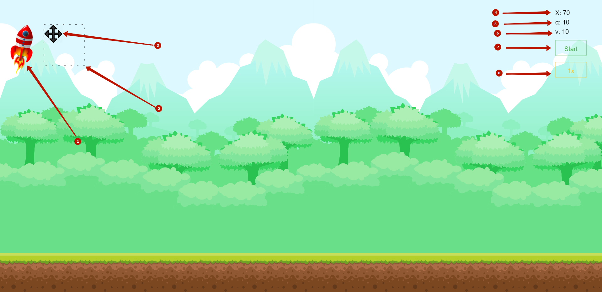
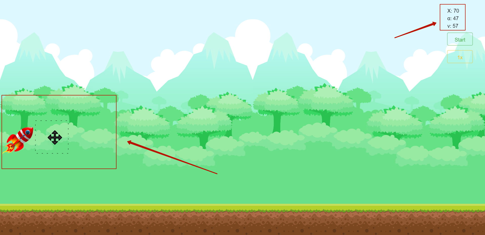
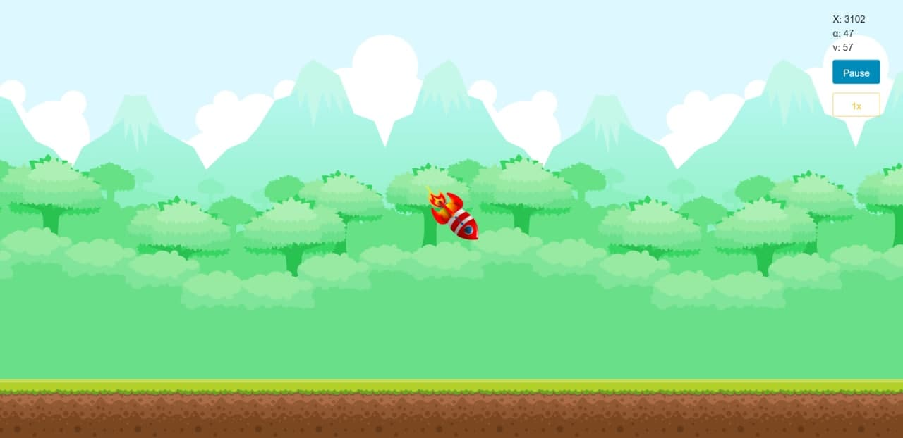
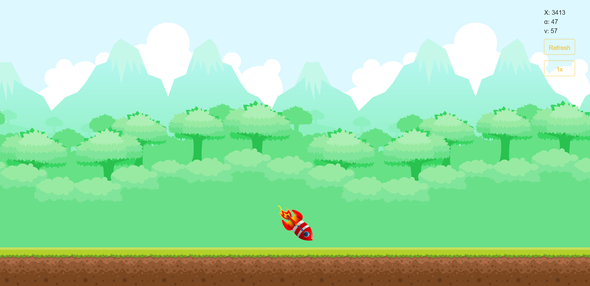
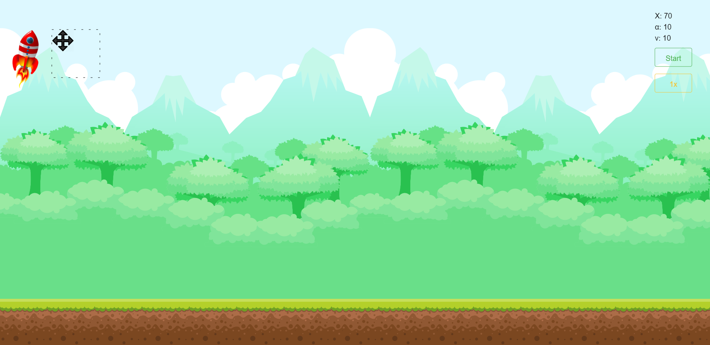
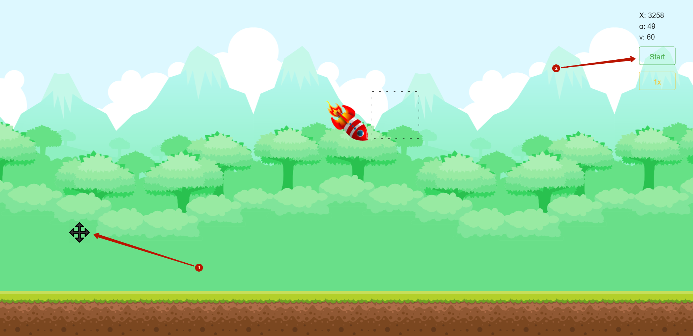

# DevChallnge 2020 Frontend Code

Приложение работает исключительно с Web сервером.
Для установки Web сервера, нужно выполнить команду:
```
npm install
```

Для запуска приложения, выполняем команду:
```
npm start
```

Приложение запускается на _localhost:3000_

Web сервер автоматически запускает приложение в браузере, однако для корректной 
работы приложения, нужно ещё дополнительно обновить страничку (Ctrl+R).
Связанно это с тем, что в приложении не реализована функция загрузки (preloader).

 

Перед нами интерфейс приложения. 
1. Ракета (Игрок). Её можно перемещать по оси Oy, с помощью Drag'n'Drop, тем 
самым задавая начальную высоту.
2. EditArea. Область в которой можно перемещать EditMove, с помощью Drag'n'Drop 
в осях OxOy.
3. EditMove. Перемещая по оси Oy, задаёт угол к горизонту в промежутке \[10; 80\].
Перемещая по оси Ox, задаёт вектор скорости в промежутке \[10; 80\].
4. Label 1. Отображает информацию о текущей координате X.
5. Label 2. Отображает информацию о текущем угле к горизонту.
6. Label 3. Отображает информацию о текущем векторе скорости.
7. Button 1. Запускает работу симуляции. Сменяется на кнопку Pause во 
время работы симуляции, для того чтобы можно было остановить её на паузу и 
скорректировать высоту, угол и вектор скорости. Сменяется на кнопку Refresh
по окончанию работы симуляции, чтобы возобновить все значения по умолчанию
8. Button 2. Изменяет скорость симуляции. Существует три скорости: 1x, 2x и 3x.
Соответствующая скорость симуляции, отображается на надписи кнопки.

 

Задаём высоту, угол к горизонту и вектор скорости.

 

Работа симуляции. Доступная кнопка Pause.

 

Окончена работа симуляции. Доступная кнопка Refresh.

 

По нажатии кнопки Refresh, восстановили все значения по умолчанию.

 

Нажата кнопка Pause, во время работы симуляции.
1. Маленький глюк. Для того чтобы вернуть EditMove в область EditArea, нужно для начала
скорректировать высоту ракеты, после чего координаты EditMove и ракеты, синхронизируются.
2. Доступная кнопка Start, для запуска симуляции после коррекции.
